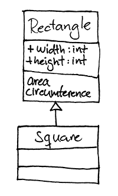

# Rectangle #

Den här uppgiften går ut på att skriva klasser som räknar ut area och omkrets på olika typer av rektanglar

## Bedömningsmatris ##

## Planering ##

| Förmåga                           | E                                                                                                                                 | C | A |
|-----------------------------------|-----------------------------------------------------------------------------------------------------------------------------------|---|---|
| Design                            | Med viss säkerhet analyserar du uppgiften och designar ditt program |    | Som för E, men med säkerhet, och du motiverar dessutom utförligt dina val |

## Kodning och dokumentering ##

| Förmåga                           | E                                                                                                                                 | C | A |
|-----------------------------------|-----------------------------------------------------------------------------------------------------------------------------------|---|---|
| Strukturering                     | Din kod är delvis strukturerad | Din kod är i stor utsträckning strukturerad | |
| Kodningsstil                      | Du använder en konsekvent kodningsstil  för klasser, moduler, metoder, variabler, kommentarer och dokumentation | | |
| Namngivning                       | Du använder en tydlig namngivning i din kod | | |
| Dokumentering                     |                               |   | Du dokumenterar utförligt dina klasser och metoder

## Felsökning ##

| Förmåga                           | E                                                                                                                                 | C | A |
|-----------------------------------|-----------------------------------------------------------------------------------------------------------------------------------|---|---|
| Typsäkerhet                       | Du uppmärksammar problem med typsäkerhet | | |
| Felsökning                        | Du felsöker enkla syntaxfel | Som för E, men effektivt, och dessutom även körtidsfel och programmeringslogiska fel | Som för C, men du använder dig av tester för att systematiskt och effektivt upptäcka och förhindra fel |

## Slutrestultat och Uppföljning ##

| Förmåga                           | E                                                                                                                                 | C | A |
|-----------------------------------|-----------------------------------------------------------------------------------------------------------------------------------|---|---|
| Komplexitet                       | **Det färdiga programmet är av enkel karaktär, fungerar tillfredsställande, och är stabilt och robust** | Som för E, men av lite mer avancerad karaktär | Som för C, men programmet är av komplex karaktär, följer SOLID, och fungerar väl |
| Utvärdering                       | Du utvärderar, med enkla omdömen, programmets prestanda och funktionalitet | Som för E, men nyanserade omdömen | Som för C, men du ger även förslag på förbättringar | 

## Uppgiftsbeskrivning ##

Du ska implementera två klasser: `rectangle` och `square`, enligt nedan:

Rectangles konstruktor tar två argument: `width` och `height`

Squares konstruktor tar ett argument: `side`

implementera `area` och `circumference` enligt diagrammet ovan

### Exempel ###

#### Ruby ####

	r = Rectangle.new(width: 30, height: 40)
	r.area # => 1200
	r.circumferens # => 140
	
	s = Square.new(side: 20)
	s.area # => 400
	s.circumference # => 80

## Genomförande ##

### Versionshantering ###

Gör en `fork` av repot. Klona sen ner till din dator. Kom ihåg att checka in dina ändringar och synka med GitHub.

### Flödesschema ###

Innan du börjar koda ska du skapa ett flödesschema för programmet.
När du känner att du har ett fungerande flödesschema, be läraren att kolla på det.

### Kodning ###

Programmet skall utvecklas med hjälp av testerna.

##### Ruby #####

Kör `bundle install` för att installera alla dependencies (och `rbenv rehash` om rspec inte redan var installerat)

Skapa klasserna i `lib/rectangle.rb`

Testerna finns i `spec/rectangle_spec.rb` & `spec/square_spec.rb`.

Kör `rspec klassens_namn_spec` för att köra testerna för den specifika funktionen, eller enbart `rspec`för att köra samtliga testfiler .

## Tips och länkar ##

* Om du inte kan beskriva lösningen i ord kommer det vara så gott som omöjligt att skapa ett flödesschema
* Fundera på vilka variabler som behövs
* Testa flödesschemat med hjälp av penna och papper

### Ruby ###

#TODO: länka till hjälpmaterial (t.ex learn ruby the hard way & rubydocs)

